# IB, RoCEv2 + GPU Cluster Network Design, ROD/RUD — 요점정리

---

## 1 — 인터커넥트 4형제 + PCIe

칩(다이) → 패키지 → 노드 → 랙으로 올라가며 통로가 달라진다.

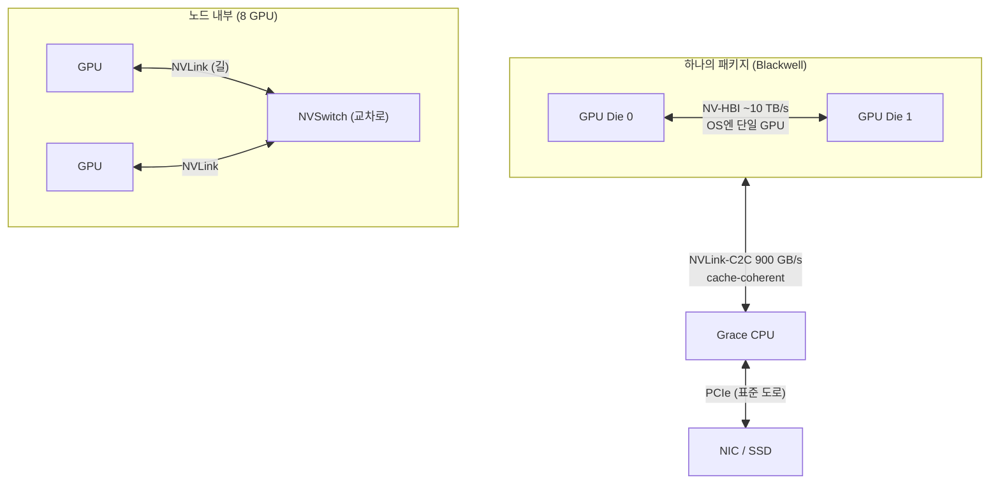

| 기술 | 연결 | 핵심 |
| --- | --- | --- |
| **NV-HBI** | 패키지 내 다이↔다이 | 듀얼 다이를 ~10 TB/s로 이어 **OS엔 단일 GPU** |
| **NVLink-C2C** | 같은 패키지 CPU↔GPU | 900 GB/s, **cache-coherent**, 복사 없이 상대 메모리 접근 |
| **NVLink** | GPU↔GPU 직접 | CPU 우회로, 위 둘의 뿌리 |
| **NVSwitch** | NVLink를 한 칩에 모음 | **All-to-All** 패브릭, NVLink='길'/NVSwitch='교차로' |
| **PCIe** | CPU↔주변장치 | 범용 표준, NVLink 대비 같은 세대 **~1/14**(Gen5×16 ≈128 vs NVLink5 1.8 TB/s) |

- **lane**: 전선 한 가닥(차동 한 쌍) 수준 최소 물리 단위(PAM4 레인당 200 Gb/s). **rail**: 랙 간 네트워크 통로 — 각 노드 0번 GPU를 '레일 0'으로 묶는 식(→ 7장).

**GPU 세대**: A100(80GB,FP16) → H100(FP8 Transformer Engine) → H200(**141GB**, 추론용 메모리↑) → B200/B300(**FP4**+듀얼다이). **NVLink 5세대**는 링크 18개 유지·링크당 50→100 GB/s로 1.8 TB/s.

**NVSwitch/NVL72**: 4세대에서 NVSwitch를 서버 밖 트레이로 분리 → 랙 72 GPU를 **130 TB/s All-to-All** 논블로킹으로 묶어 사실상 하나의 GPU처럼. 3세대부터 **SHARP**(스위치 내부 reduce offload)로 AllReduce 트래픽 절감. 확인: `nvidia-smi topo -m`(NV#=NVLink/SYS=PCIe).

---

## 2 — NCCL & 집단 통신

분산 학습의 GPU 통신 라이브러리. PCIe·NVLink·NVSwitch·IB·RoCE를 자동 토폴로지 감지로 활용.

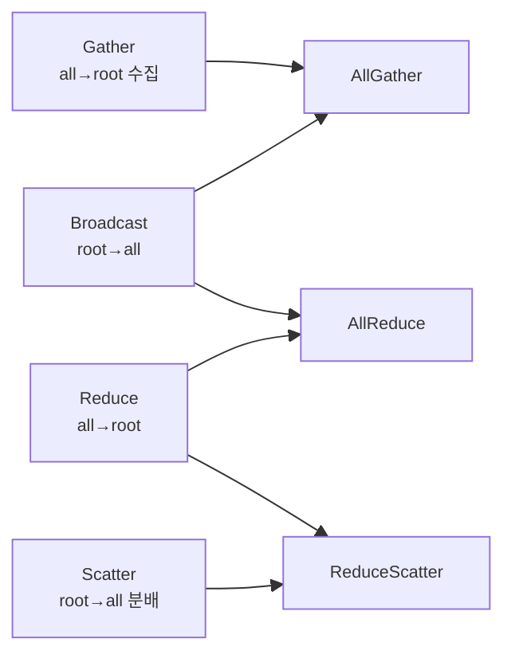

| Collective | ML 용도 |
| --- | --- |
| `AllReduce` (Reduce+Broadcast) | **DDP gradient sync** |
| `ReduceScatter` | **FSDP gradient** |
| `AllGather` | **ZeRO-3/FSDP param** |
| `AllToAll` | **MoE token dispatch** |

- 같은 AllReduce도 메시지 크기·노드 수·NVSwitch 유무에 따라 **알고리즘 7×프로토콜 3 = 21칸 표**에서 cost model로 최적 선택(argmin). 알고리즘: Ring/Tree/CollNet(SHARP)/NVLS(NVSwitch multicast). 프로토콜: LL/LL128(NVLink sweet spot)/Simple.
- **Intra-node 경로 우선순위**: ① NVLink P2P ② PCIe P2P ③ SHM(host 경유) ④ NIC loopback. 등급 `NV#`>`PIX`>`PXB`>`PHB`>`NODE`>`SYS`(소켓 간, **최악**).
- **Inter-node**: CPU proxy 스레드가 NIC RDMA write를 post. **GPUDirect RDMA** 가능 시 NIC가 GPU 메모리 직접 접근, 불가 시 host staging(PCIe 2회 추가).

---

## 3 — NUMA & 토폴로지 인식

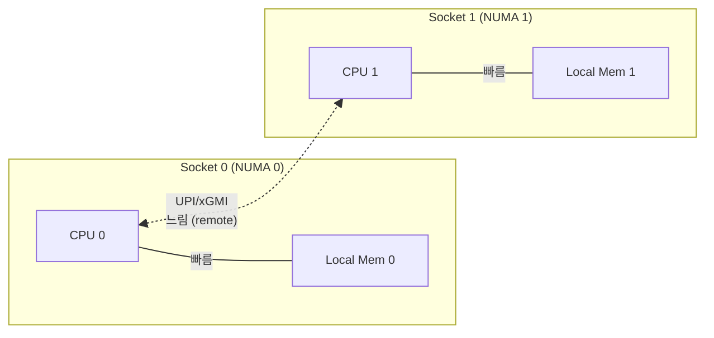

- **배경**: SMP 중앙 버스 병목 → CPU마다 로컬 메모리. 단 **원격 소켓 메모리는 느림**. 소켓 간 링크(UPI/xGMI)는 **NVLink·로컬 PCIe Gen5보다 느림**.
- **NUMA-aware 핵심**: GPU·NIC·메모리를 **같은 소켓/NUMA에 pin**. `SYS`(QPI/UPI 경유) 경로는 GPUDirect P2P/RDMA가 "극히 제한·동작 안 함". **PCIe ACS는 끈다**. `nvidia-smi topo -m`으로 검증(`PIX/PXB` 양호, `PHB/NODE/SYS` 재배치).
- K8s: `cpuManagerPolicy: static` + `topologyManagerPolicy: single-numa-node`.

**단일 호스트 Multi-GPU 스펙트럼** — "GPU 개수"가 아니라 "**연결 경로**"가 scaling을 좌우(집단 연산은 가장 느린 경로를 기다림).

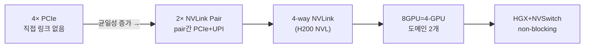

- 8 GPU 서버 = 항상 단일 fabric 아님(4-GPU 도메인 2개일 수도). parallelism에 맞춰 선택: DP(PCIe 가능)/TP(균일 링크)/PP(stage 배치)/MoE(NVSwitch). **Fabric Manager**가 NVSwitch topology·partition 관리.

---

## 4 — InfiniBand & RDMA

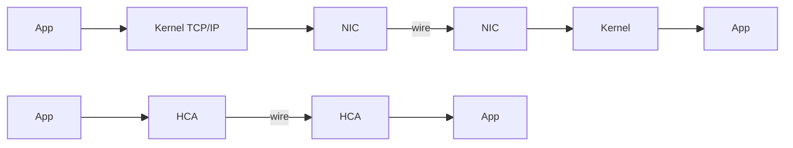

RDMA가 빠른 3요소: **Kernel bypass**(커널 우회) + **Zero-copy**(NIC가 사용자 버퍼 직접 DMA) + **Transport offload**(헤더·재전송·ordering을 HCA HW가). Control path(QP 생성·MR 등록)만 커널 1회 경유.

| 연산 | responder CPU | 용도 |
| --- | --- | --- |
| **Send/Recv** (two-sided) | 개입 O | 제어 메시지 |
| **RDMA Write** (one-sided) | 개입 X | 일방 전달 (**NCCL 기본**) |
| **RDMA Read** (one-sided) | 개입 X | pull, KV cache 회수 |
| **Atomic** (one-sided) | 개입 X | 분산 락·counter |

- One-sided는 HCA가 **rkey 검증** 후 직접 DMA(상대 CPU 인지 못함). **Write가 Read보다 빠름**(데이터 한 방향+작은 ACK vs round-trip) → NCCL은 Write 중심.

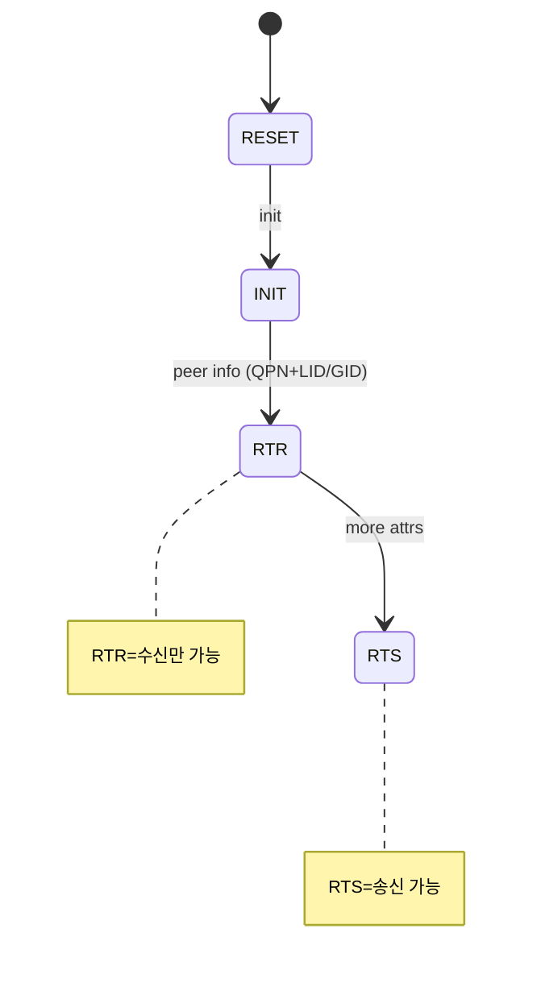

- **QP = TCP 소켓에 해당** 종단점(SQ+RQ 쌍). **WQE**(작업 명령서) → `ibv_post_send/recv` → Doorbell → 완료는 **CQE**가 CQ에. **MR**이 lkey/rkey 발급, **PD**가 보안 경계. Transport는 **RC**(=TCP, RDMA Read/Atomic은 RC만), UC, UD(=UDP), DC.
- **IB 아키텍처**: HCA / Switch(LID 포워딩) / Router(GRH IPv6) / **Subnet Manager**(LID 할당·라우팅, 패브릭의 두뇌). 계층 Physical/Link(**credit 기반 흐름제어 → 무손실**)/Network/Transport(HW)/Upper. 커널은 사라지지 않고 **초기 설정·자원 보호**(pinning, MR, PD/QP/CQ, lkey/rkey) 담당.

---

## 5 — InfiniBand vs RoCEv2

핵심: **RDMA 상위 절반(Verbs·QP·MR·RC/UC/UD)은 동일**, "wire 전송 방식"에서만 분기.

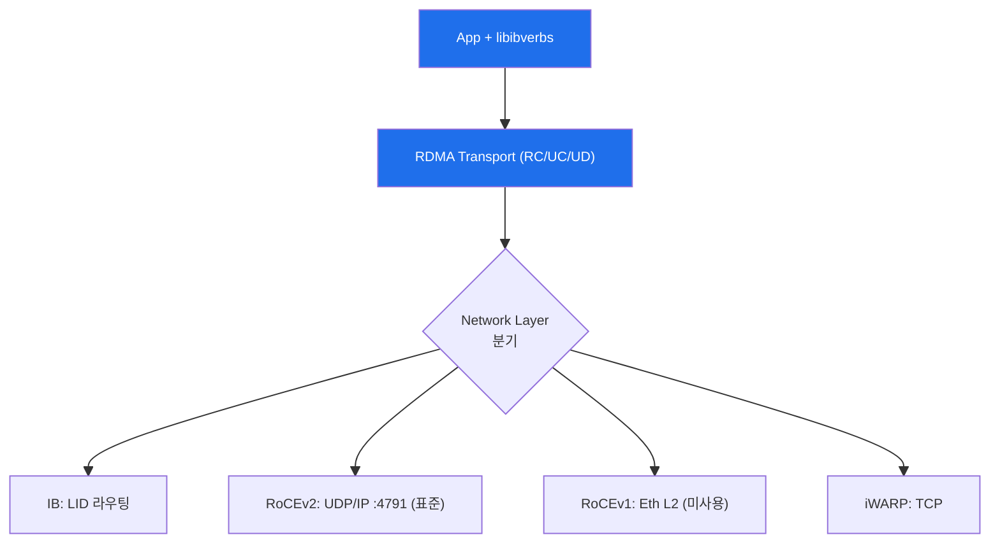

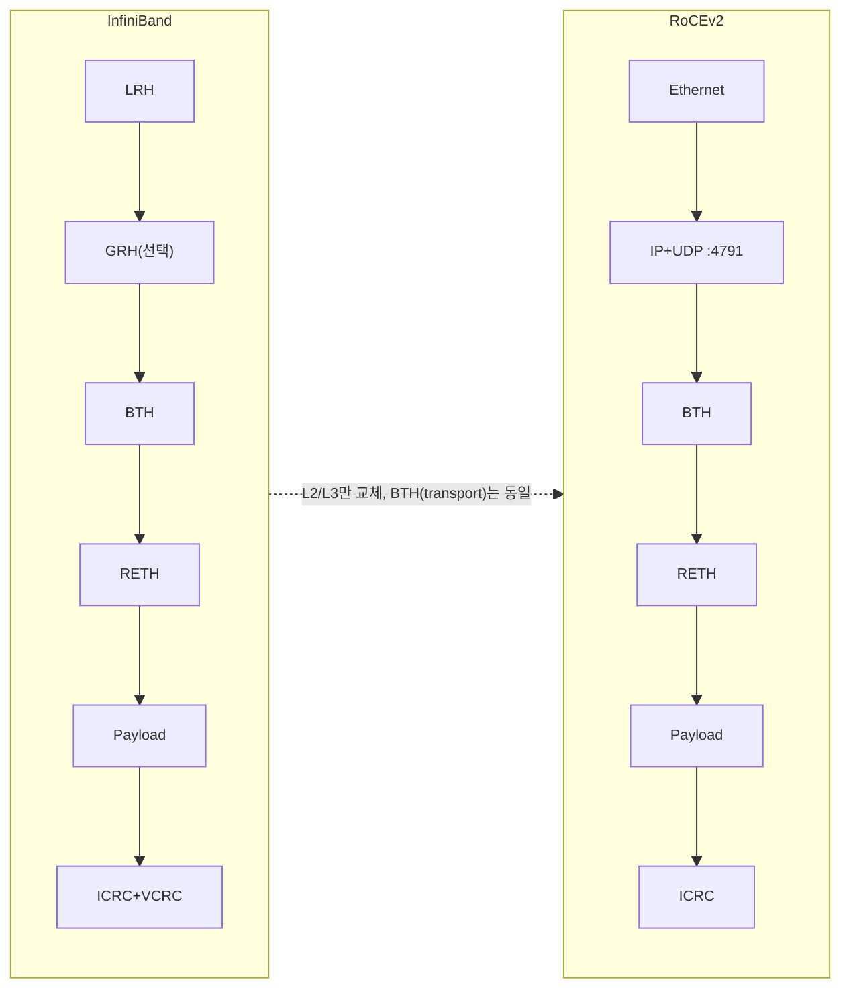

- **BTH**: OpCode/**DestQP**/**PSN**(순서·재전송)/AckReq/FECN·BECN. RDMA WRITE엔 **RETH**(원격 VA+R_Key+길이).
- **주소**: IB=**LID**(16b, subnet 내부만). RoCEv2=**GID**(IP를 IPv6 인코딩). 코드 분기점은 `is_global` 플래그(IB:0/RoCEv2:1) — 오설정 시 **silent fail**. RoCEv2는 SM 불필요(대신 이더넷 스위치 설정 중요).

| 구분 | InfiniBand | RoCEv2 |
| --- | --- | --- |
| 라우팅 | LID/GID, SM | **IP 라우팅 (L3)** |
| Lossless | credit 기반 보장 | **PFC/ECN/DCQCN 튜닝** |
| 멀티패스 | 약함 | **ECMP**(UDP src port=flow id) |
| 운영 | 전용 장비 | 이더넷 지식+RoCE 튜닝 |

- **RoCEv2 과제 = Lossless Ethernet**: 이더넷은 기본 lossy, RC 재전송은 **go-back-N**이라 손실에 치명적 → PFC+ECN/DCQCN 필요. MTU는 보통 **Jumbo 9000 후 RoCE 4096**(경로 hop 일치). 격언: *"IB는 line rate, RoCEv2는 절반이면 십중팔구 PFC/ECN/DSCP 설정 문제"* — 성능의 90%가 스위치/NIC 설정.
- **2026 추세**: 클라우드는 RoCEv2/변종(AWS EFA·Google Falcon·Meta RoCE), IB는 latency·단순함으로 top tier(DGX SuperPOD, Quantum) 잔존.

---

## 6 — RoCEv2 혼잡 제어

> UDP 기반이라 TCP식 자동 복구·혼잡제어가 없다 → **PFC(L2 정지)+ECN(E2E 감속)+DCQCN(통합)**, 차세대 **SFC/CSIG**.

**Incast**: 전체 용량이 충분해도 여러 흐름이 같은 링크에 몰리면 혼잡. AI는 **elephant flow**가 많아 ECMP 해시가 겹치면 즉시 혼잡 + gradient sync 시 **버스트**.

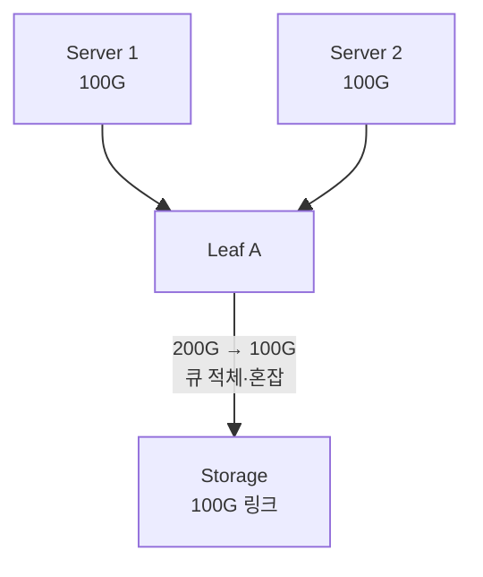

혼잡 지점: Local leaf / Leaf→Spine(ingress) / Spine→Leaf(transit) / Leaf→Server(egress) / Spine↔SuperSpine.

### ECN — "천천히 보내세요" (E2E, L3)

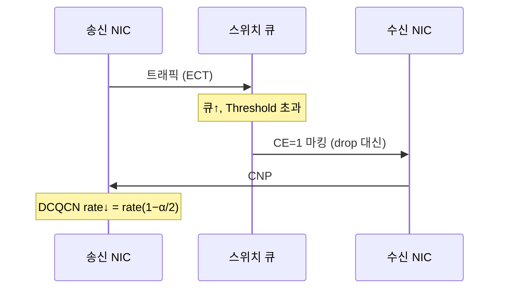

- ECN 2비트: `11`=혼잡경험(CE), `01`=CNP. **CNP**=수신자→송신자 알림(Opcode 129). **한계**: CNP 왕복 지연 동안 큐가 차면 drop 가능(ECN 큐=Lossy Queue). 경로는 안 바꿈.

### PFC — "이 차선 멈춰" (Hop-by-Hop, L2)

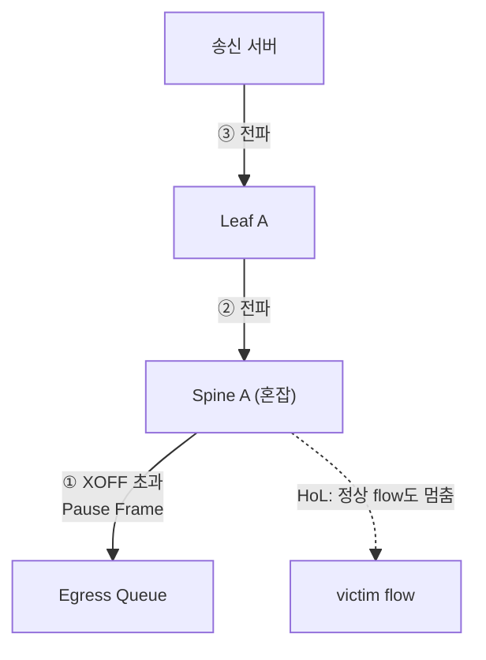

- Pause Frame(0x8808), **XOFF**(멈춤)/**XON**(재개). **문제①HoL Blocking**(flow 아닌 Class 전체 정지, victim 20→4.5Gbps) **②PFC Storm**(상위 전파로 무관한 랙까지). **PFC Watchdog**: Detection→Mitigation(보통 Drop으로 Storm 차단)→Restoration.

### DCQCN — ECN(부드러운 브레이크) + PFC(급브레이크)

원칙: **ECN Threshold < PFC XOFF Threshold** (ECN 먼저 감속, 안 되면 PFC 최후 방어).

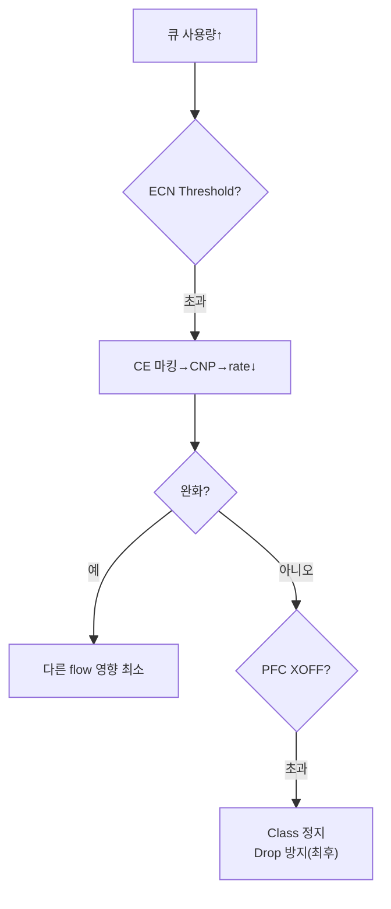

- 계산·속도조절은 **스위치 아닌 서버 NIC**(스위치는 RED+ECN만). per-flow로 문제 flow만 감속, slow start 없이 line rate 시작. 조합: `ECN+CNP+DCQCN+PFC+Watchdog+QoS+Buffer Tuning`.

### 차세대 SFC / CSIG

| 기술 | 알림 | 단위 | 특징 |
| --- | --- | --- | --- |
| **SFC** | 혼잡 스위치→**송신자 직접** | Flow | S/D IP 반전+**Payload Trim**, 빠르고 영향 작음, NIC 지원 필요 |
| **CSIG** | 경로 태그→수신자 반사 | Flow+경로 | **in-band telemetry**, 병목 위치·장비ID·용량 → rate+경로 선택, Draft 단계 |

> **proactive > reactive**: ECN/PFC는 사후 대응. **ECMP 로드밸런싱(proactive)** 만 잘 해도 대부분 ECN/PFC 발생을 최소화. 목표는 "loss 복구"가 아니라 "**애초에 loss가 안 나게**".

---

## 7 — GPU Cluster Network Design & ROD/RUD

> 설계 목표: **비싼 GPU가 네트워크 때문에 기다리지 않게** = JCT 최소화 + loss 방지.
> **JCT**는 가장 느린 스레드(=**tail latency**)에 좌우 — 백만 작업이면 드문 지연도 매번 발생.

| 요구사항 | 내용 |
| --- | --- |
| **High-radix** | 포트 많은 스위치 → 적은 계층으로 32K~64K GPU(Leaf 1대 ~1000 GPU), latency·비용·복잡도↓ |
| **Oversubscription** | 이상은 서버측 BW = 패브릭측 BW = **1:1 (non-blocking)** |
| **Optimized (Rail)** | 서버 내부(GPU·NIC·PCIe·NUMA·NVLink)까지 고려, GPU0↔NIC0 가까운 짝 |

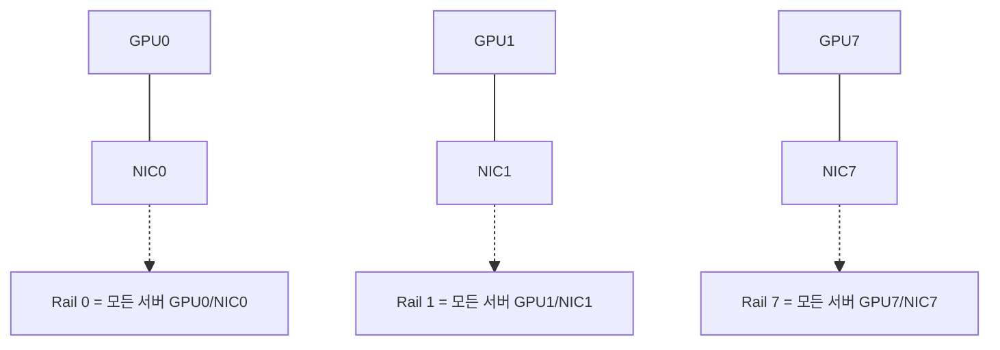

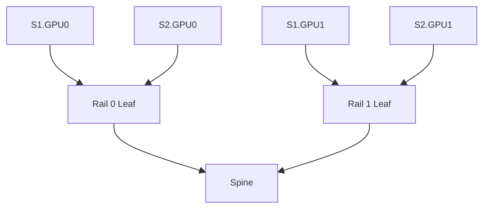

- **ROD(레일 최적화)**: 각 노드 **같은 번호 GPU를 같은 레일 스위치**로 묶음 → 같은 rank 집합통신이 전용 레일에 격리, 충돌↓·예측 가능. **AI 백엔드 표준**(Spectrum-X RA 채택). 배경: 서버 내부 GPU switch 덕에 번호별로 묶을 "기회"가 있음.
- **RUD(레일 통합)**: ROD의 대안으로 함께 고려(원문은 ROD 주력, RUD는 대안 언급).

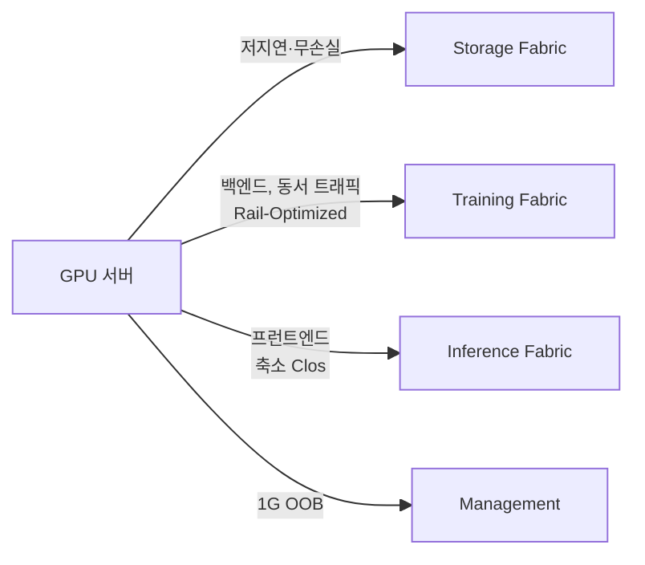

- **NVIDIA RA**: **SU(4노드)** 단위 복제, 노드당 8×ConnectX-8=64×400G=**25.6 Tb/s**. Spectrum-X + non-blocking fat-tree + leaf-spine + rail-optimized. 예: 32노드×8 = **256 HGX B300 GPU**.

---

### 한 줄 요약

- 노드 안은 **NVLink/NVSwitch로 PCIe·소켓 우회**, 노드 밖은 **RDMA로 커널·복사 우회**.
- RoCEv2는 코드가 아니라 **PFC/ECN/DCQCN 튜닝**이 성능의 90%.
- 설계 목표는 **JCT 최소화**(tail latency·혼잡 제거) + **ROD**로 집합통신 충돌 회피.

---
